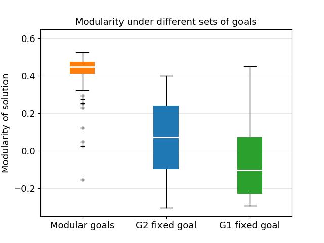

# Spontaneous evolution of modularity in logic gate networks

Some of the findings outlined in [this](https://doi.org/10.1073/pnas.0503610102) paper by Nadav Kashtan and Uri Alon are replicated. See the paper for more detailed exploration of the results and a more in depth explanation. This was intended only as a learning exercise inspired by [a lecture](https://youtu.be/cdaynA0PyPU) by Uri Alon.

## Goals

Evolution in nature has produced no shortage in diversity in design of biological systems. A common feature of most of these systems is that they are *modular*. Modular meaning they can be decomposed into self-contained parts that interact with each other. Signalling networks, for example, are made up of modules that can be changed or rewired by the synthetic biologist to alter the behaviour of the system. Intriguingly, when evolution is simulated it tends not to produce such modular systems. Here, evolutionary algorithms are applied to networks of logic gates to explore the modularity of solutions under different selection pressures. In line with the findings of the paper, time-varying selection pressures, which share some sub-goals, are found to lead to more modular outcomes.

## Components

### Networks of logic gates

Networks of logic gates are used as a model problem. Networks of NAND gates can encode any boolean function depending on how these gates are wired together. NAND gates take in two inputs and output `True` if either of them is `False`. The problem statement is therefore to find the smallest such network that implements a given boolean function. To be acted upon by the evolutionary algorithm, every potential solution has to be encoded by a genome. Every two numbers in the genome represent the inputs of a gate (see Fig. 1). Negative numbers represent the inputs of the network and the output of the network is given by the output of gate 0.

  

  Fig. 1 - Example of a genome and the network it represents

The quality of a solution is judged by the similarity of the network's output to the desired output, for every combination of inputs (see Table 1).

  

  Table 1 - Evaluating the network in Fig. 1 to obtain a value of 0.25 for its accuracy.

### Evolutionary algorithm 

To reach a solution, the evolutionary algorithm works as follows:

1. A population of random networks is produced to obtain the first generation. 
2. The fitness of every individual is evaluated and an elite fraction selected from the most fit individuals. 
3. The next generation is made up first by a copy of every individual in the elite fraction and then by further copies, this time with random mutations. The population size is kept fixed.

By repeating steps 2 and 3 iteratively, the fitness of the population slowly increases, representing better and better solutions.

Mutations can be point mutations, which switch the input of a single gate for another input; deletions, which delete a gate and rewire everything that was connected to it; additions, which produce a new randomly wired gate; and crossovers, which swap parts of two genomes to produce two new genomes.

### Modularity measure

Modularity is a property of a partition of a network into modules. The modularity of a partition is the sum over all modules of the fraction of the edges that lie within that module minus the expected number for this quantity. For information on how to find the partition and then calculate its modularity refer to [this](https://doi.org/10.1103/PhysRevE.69.066133) paper. Here, the algorithm is implemented by the python library `networkx`.

The modularity thus obtained, `Qreal`, can be normalized with respect to randomly generated networks to obtain `Qm`. This measure can be found from the expression:

`Qm = (Qreal-Qrand)/(Qmax-Qreal)`

Where `Qrand` is the modularity of a randomly generated network and `Qmax` the maximum modularity of a network. Both measures refer to networks with connectivity matching that of the possible solutions, i.e. with at least 10 gates connected to gate 0. `Qrand` was found by generating many random networks, finding their modularity and taking the average. `Qmax` was found by applying the evolutionary algorithm with the fitness of a genome being its modularity. In this scheme, a network with `Qm` of 1 has the maximum possible modularity and `Qm` of 0 has the modularity of a randomly generated network. Networks with negative `Qm` are nonetheless possible if they are less modular than a random network.

## Results

The evolutionary algorithm was challenged with creating a network of NAND gates that would take four boolean inputs and output the same value as some function `G`. The fitness function was the fraction of all inputs that produced the correct output, with a small penalty for size being over a certain cutoff. This ensured that networks would remain small. 

The first boolean functions attempted were `G1 = I₁ XOR I₂ AND I₃ XOR I₄` and `G2 = I₁ XOR I₂ OR I₃ XOR I₄`. Over the 50 runs carried out for each goal, 37 and 32 runs, for G1 and G2 respectively, reached solutions within 10⁵ generations. Over the runs that did reach a solution, the number of generations taken was 3000 (-1000, 4000) and 11000 (-5000, 15000) for G1 and G2, respectively. It is interesting that despite G2 seemingly being of the same complexity it took about four times as many generations to reach a perfect solution. The fitness of the most fit individual over time in a typical run is shown in Fig. 2.

  

  Fig. 2 - Typical run with fixed goals. The increase in fitness shows logarithmic slowdown, a common feature of evolutionary algorithms

Despite both goals being strictly modular, being made out of two XOR modules and an AND/OR module, the solutions that were found had very low modularity. They had values of Qm of -0.05 ± 0.2 and 0.07 ± 0.18 for G1 and G2, respectively.

The paper suggests, and confirms, that evolving networks under "modularly varying goals" would produce modular solutions. The key insight is that if the goal is varied every few generations, *but the goals have shared subgoals*, those individuals that had evolved modules dedicated to solving one of the subproblems would find it easier to adapt to the new goal.

Here the goal is switched every 20 generations between G1 and G2. All 100 runs terminated within 10⁵ generations and took 1500 (-700, 1300) generations. A typical run can be seen in Fig. 3. As expected, the modularity of solutions under time-varying modular goals was much higher than that evolved under fixed goals, with Qm = 0.42 ± 0.10 (see Fig. 4).

  

  Fig. 3 - Most fit individual at the end of every epoch (Top). Towards the end, one of the goals is solved but the other is not, leading to switching behaviour. Most fit individual every generation at the end of the run (Bottom). As soon as the goal is switched, the fitness drops and then returns to 1 within 10 generations. 

  

  Fig. 4 - Average modularity of the perfect solutions produced under three different types of goals. Those under time varying modular goals are significantly more modular.

The difference in modularity can often be seen by eye (see Fig. 5), with those evolved under modularly varying goals having modules which's function can be understood.

  

  Fig. 5 - Network evolved under modularly varying goals. (Top) G1 network and (Bottom) G2 network, separated by only two point mutations. The function of each module can sometimes be understood by inspection. 

The paper also explores the outcome of performing fixed goal evolution on already perfect, modular solutions. As time goes on, the modularity is found to fall and then stabilize (see Fig. 6)

  

  Fig. 6 - Average modularity across a generation with time. Each plot is a separate simulation made up of 20 runs. Each run started with a different population of 1000 identical, perfectly fit and modular solutions.

## Conclusion

Some of the findings of the paper by Uri Alon and Nadav Kashtan are reproduced. Notably the fact that electrical circuits evolved under time varying modular goals are shown to produce highly modular solutions when compared to those evolved under fixed goals. The decay of modularity when perfect solutions are evolved under fixed goals is also replicated.

## Future

There are some experiments from the paper that were not implemented. These include evolution under more complex goals, both fixed and time-varying, and evolution of neural networks. These experiments are important because they were used to show that evolution under modularly varying goals leads to shorter generation times and that this improvement scales with the complexity of the task. They also took more measurements, including measurements of the modularity of biological networks and of the relative abundance of network motifs in evolved networks.

## Usage

The repository contains the following python scripts, together with the data they generated:

- `NetworkFunctions.py` contains the network manipulation functions that are used throughout
- `EvolutionFunctions.py` implements the genetic algorithm
- `FixedGoals.py` runs simulation under specified fixed goals
- `ModularGoals.py` runs simulation under specified time-varying goals
- `ModularityDecay.py` runs simulation starting with a population of identical networks with fixed goal
- `RandomModularity.py` generates random networks and measures the average modularity
- `MaximumModularity.py` runs simulation with the fixed goal of evolving maximum modularity
- `DataProcessing.py` digests the data and returns the figures and values quoted above
